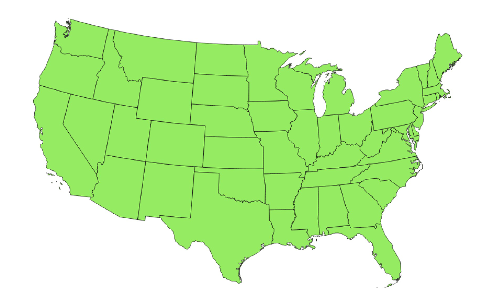
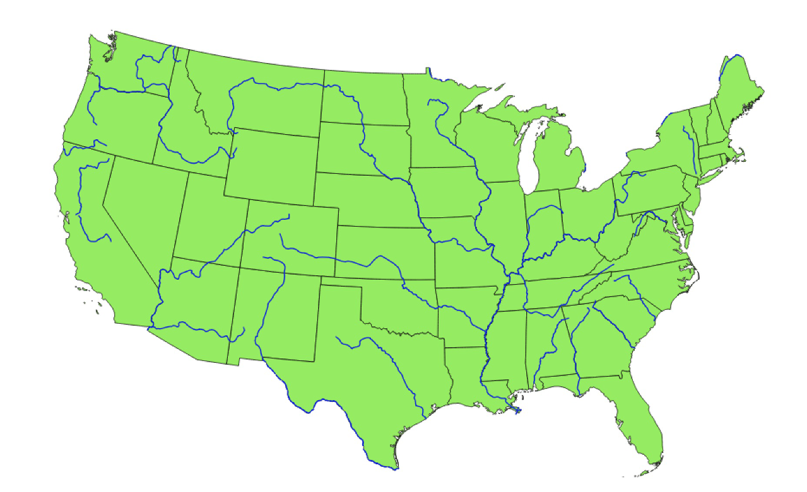
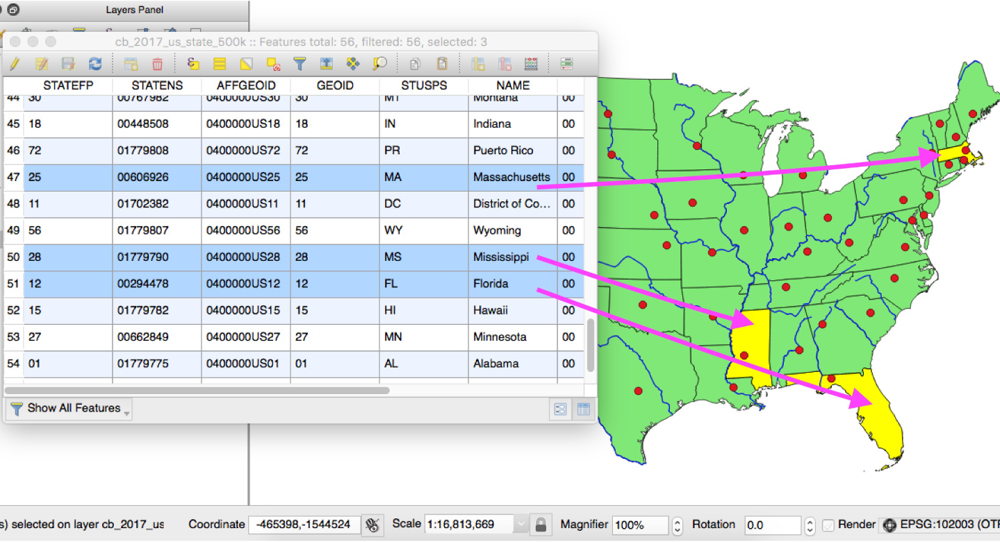

# Introduction to Mapping

Making a map is like learning a new language, it’s a slow and frustrating process because there are a lot of concepts unique to mapping and almost none of it makes sense in the beginning. This first part of the workshop is a very quick overview of mapping concepts to help orient you to the process of mapmaking. 

In this map of the United States we see three basic shapes—the cities are represented by points, the main rivers are represented by lines and the states are represented by polygons. While this is a very simple map, most maps that you’ve seen, even the most intricate ones only consist of these three basic shapes--points, lines and polygons. This type of mapping data is called ‘vector data’. 

Sidebar: There is another important type of data that we will not be using in this workshop, but you should be aware of. It’s called ‘raster data.’ Raster data is an image, such as a satellite image, with ‘geolocations’--which just means location data. It’s beneficial to store geographic data as raster data when you are working with continuous data, such as heat or elevation. 

Voilà!

## Features and Attributes

Another mapping concept that’s important to know is that the visualizations that are displayed on the map are called the map’s ‘features’ and the data that’s connected to those shapes are called the maps ‘attributes.’ Attribute data is stored in an attribute table, which is a lot like spreadsheet. One feature on the map can contain many attributes--the feature for the state of Florida has the attributes “STATEFP” (the state ID), “STUSPS” (the state abbreviation), “NAME” (the state name), etc. Any type of data that you have at the scale of the state can be put in this attribute table. The attribute table stores all of the data and then you decide what data you want to visualize.  

## Challenge: Here you can put a title

Paragraph... image... whatever you want. subtitle..

## (Optional) Solution

Paragraph.. image... subtitle..

## (Optional) Evaluation

Multi-choice question/open-ended question/single-choice question formulated as a question?
- choice 1
- choice 2*
- choice 3
- choice 4*

## (Optional) Keywords

Do you remember the glossary terms from this section?

- Term
- Term
- Term
- [Term](https://github.com/DHRI-Curriculum/glossary/blob/v2.0/terms/term-file.md)

# Title (for lesson 2)

....