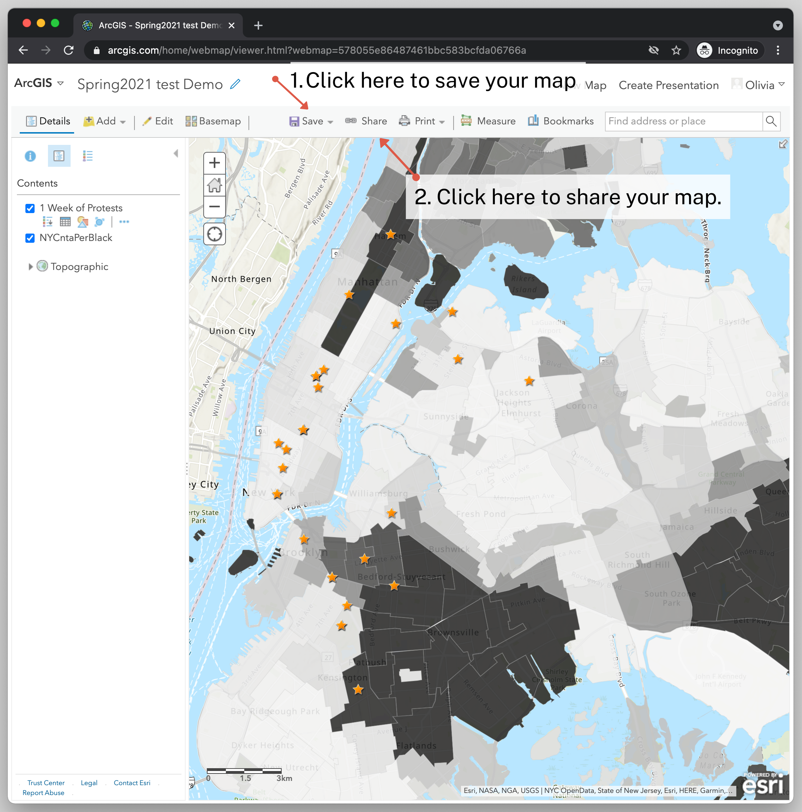

← [Formatting the Legend](13-formatting-the-legend.md)&nbsp;&nbsp;&nbsp;|&nbsp;&nbsp;&nbsp;[Title (for lesson 2)](15-title-(for-lesson-2).md) →

---

# 14. Saving and Sharing Your Map

Now it’s finally time to save and share your map!

1. To save the map, click the **Save** button (with the floppy disk icon). Enter your title, tags, and summary to describe the map. Then click **Save Map**.

2. To share your map, click on the **Share** button (with the chain link icon). 
3. Click the checkmark next to **Everyone (public)** so that you can share the map with the public. Once you do that, all of the share options will become available to you, including sharing the URL to the map or getting embed code to put the map on a website. 

Congratulations! You’ve made a pretty cool interactive map with two layers of spatial data, multiple pop-ups, and even multimedia with your pop-ups!

## Challenge: Here you can put a title

Paragraph... image... whatever you want. subtitle..

## (Optional) Solution

Paragraph.. image... subtitle..

## (Optional) Evaluation

Multi-choice question/open-ended question/single-choice question formulated as a question?
- choice 1
- choice 2*
- choice 3
- choice 4*

## (Optional) Keywords

Do you remember the glossary terms from this section?

- Term
- Term
- Term
- [Term](https://github.com/DHRI-Curriculum/glossary/blob/v2.0/terms/term-file.md)

---

← [Formatting the Legend](13-formatting-the-legend.md)&nbsp;&nbsp;&nbsp;|&nbsp;&nbsp;&nbsp;[Title (for lesson 2)](15-title-(for-lesson-2).md) →